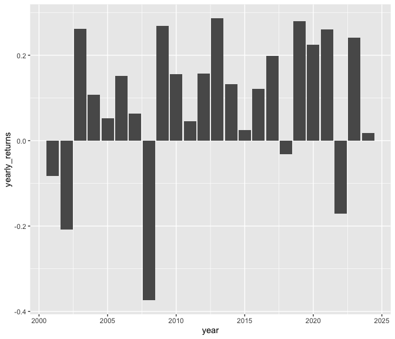

week2
================
2024-01-31

``` r
data = readRDS("wk2_stocks.rds")
cumu_returns = sum(data$SPY_returns)
# cumu_returns = 2.1833
avg_returns = mean(data$SPY_returns)
#avg_returns = 0.00037656
sd_returns = sd(data$SPY_returns)
#sd_returns = 0.012219
```

``` r
library(ggplot2)

ggplot(data, aes(x = date, y = SPY_prices)) +
  geom_line()
```

<!-- -->

``` r
library(dplyr)
```

    ## 
    ## Attaching package: 'dplyr'

    ## The following objects are masked from 'package:stats':
    ## 
    ##     filter, lag

    ## The following objects are masked from 'package:base':
    ## 
    ##     intersect, setdiff, setequal, union

``` r
library(lubridate)
```

    ## 
    ## Attaching package: 'lubridate'

    ## The following objects are masked from 'package:base':
    ## 
    ##     date, intersect, setdiff, union

``` r
yearly = data %>% 
  mutate(year = year(date)) %>% 
  group_by(year) %>% 
  summarise(yearly_returns = sum(SPY_returns))

ggplot(yearly, aes(x=year, y=yearly_returns)) +
  geom_col()
```

<!-- -->
